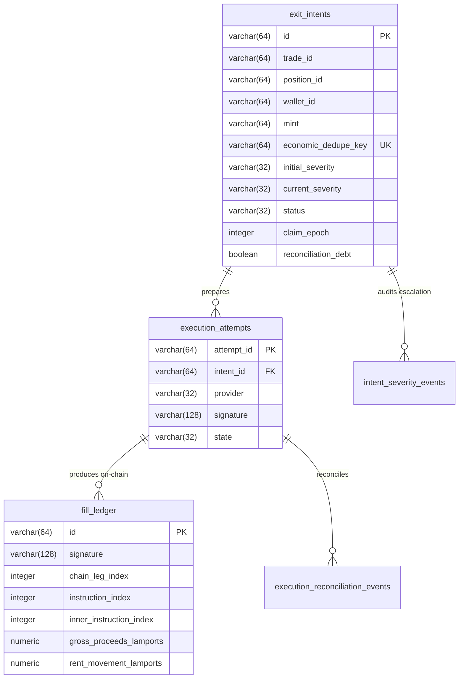

# NEXUS V2.1A — DURABLE EXIT JOURNAL & FILL LEDGER SPECIFICATION
> **Documento Normativo de Engenharia & Contrato de Dados**  
> **Status:** SHADOW / NÃO-AUTORITATIVO (`NEXUS_V2_JOURNAL_SHADOW_ENABLED=false`)  
> **Versão:** 2.1A  
> **Data:** 2026-10-04  

---

## 1. ESCOPO & SEPARAÇÃO ESTRITA DE ESTADOS

Para conformidade estrita com as diretrizes de governança do Nexus, este documento classifica inequivocamente todos os componentes entre o que foi efetivamente construído e o que permanece fora de escopo:

### IMPLEMENTED (Concluído e Testado em V2.1A)
- **Postgres DDL 001 (`migrations/001_v2_1_durable_exit_journal.sql`)**: 5 tabelas formais (`exit_intents`, `execution_attempts`, `intent_severity_events`, `fill_ledger`, `execution_reconciliation_events`).
- **Partial Unique Index (`uq_active_intent_wallet_mint`)**: Exclusão mútua garantida para intents economicamente ativas concorrendo pelo mesmo `(wallet_id, mint)`.
- **Append-Only Trigger (`trg_fill_ledger_immutable`)**: Bloqueio de mutação (`UPDATE` / `DELETE`) no ledger financeiro via PL/pgSQL.
- **Durable Claim, Lease & Fencing Epoch**: `claim_epoch` incremental estrito, bloqueio de workers zumbis via `WHERE claim_epoch = $expectedEpoch` (`rowCount = 0` / `StaleEpochError`), e detecção de lease expirada com `reconciliationDebt = true`.
- **Pure Reconciliation State Machine (`src/journal/reconciliation.ts`)**: Avaliador determinístico livre de efeitos colaterais com preservação da regra `UNKNOWN !== FAILED_DEFINITIVE`.
- **Fill Ledger Financial Accounting (`src/journal/accounting.ts`)**: Aritmética pura em `BigInt` (lamports e tokens atômicos), segregação rígida de aluguel (rent movement) e rateio proporcional de custo de entrada para saídas parciais.
- **Historical Fixtures Replay (`src/journal/shadowJournal.ts`)**: Reconstrução determinística dos incidentes Tesla, SSI, Mr Beast e SUPERPIG com IDs sintéticos padronizados (`syntheticReplayId`).

### PROPOSED (Próxima Fase — V2.1B)
- **Cutover Autoritativo**: Ativação do journal como fonte da verdade transacional no loop de execução do bot.
- **Worker Daemon em Produção**: Serviço distribuído rodando `SELECT ... FOR UPDATE SKIP LOCKED` contra o Postgres principal da Railway.

### NÃO IMPLEMENTADO (Fora de Escopo da V2.1A)
- **yellowstone-grpc / Geyser streaming**: Proibido nesta fase.
- **helius-websocket / QuickNode streaming**: Proibido nesta fase.
- **shredstream / ladybug-sdk / Reflex**: Proibido nesta fase.
- **Market Data Fusion em tempo real**: Pertence a fases posteriores.
- **Crash Detector autônomo**: Pertence a fases posteriores.

---

## 2. ARQUITETURA DE DADOS & ENTIDADES

O modelo de dados desacopla rigorosamente a intenção econômica do negócio, a tentativa técnica de envio à rede e a realização financeira efetiva na blockchain Solana.



### 2.1 ExitIntent
Representa a vontade econômica irredutível de reduzir risco ou realizar lucros.
- **Chave de Deduplicação Econômica (`economicDedupeKey`)**:
  $$\text{sha256}(\text{walletId} : \text{mint} : \text{positionVersion} : \text{requestedAmountAtomic} : \text{amountPolicy})$$
  Desacoplada intencionalmente de `reason` e de `severity`, impedindo que ruídos na detecção criem ordens concorrentes para a mesma exposição.
- **Auditoria de Severidade**: `initialSeverity` é estritamente imutável. Qualquer escalada (`NORMAL` $\to$ `HIGH` $\to$ `EMERGENCY`) registra um registro append-only em `intent_severity_events`.
- **Dívida de Reconciliação (`reconciliationDebt`)**: Marcador booleano que impede a liberação de saldo ou novas tentativas enquanto um envio anterior estiver com resultado on-chain indeterminado.

### 2.2 ExecutionAttempt
Representa cada tentativa técnica isolada de preparar, assinar e submeter uma transação via Jupiter V2 ou Pump Native.
- Rastreia o ciclo: `INITIALIZED` $\to$ `ORDER_READY` $\to$ `SIGNED` $\to$ `SUBMITTED` $\to$ `CONFIRMED` / `FAILED_DEFINITIVE` / `UNKNOWN`.
- Rastreia assinaturas Solana públicas (58 caracteres Base58), hashes de mensagens e receipt HTTP dos providers.

### 2.3 FillLedger (Estritamente Append-Only)
O livro-razão financeiro que armazena fatos confirmados na blockchain.
- **Identidade On-Chain Única**:
  $$( \text{signature}, \text{chainLegIndex}, \text{instructionIndex}, \text{innerInstructionIndex} )$$
- **Segregação de Aluguel (Rent Movement)**: O SOL devolvido pelo fechamento de contas de token (ATA) é computado em coluna segregada (`rent_movement_lamports`), jamais inflando o retorno bruto (`gross_proceeds_lamports`) ou o PnL de trading.

---

## 3. CONCORRÊNCIA, LEASE & FENCING EPOCH

O modelo de concorrência do Nexus no PostgreSQL é fundamentado em quatro pilares matemáticos:

1. **Exclusão de Claim via `SKIP LOCKED`**:
   Workers concorrentes disputam intents em aberto sem bloqueio catastrófico:
   ```sql
   SELECT * FROM exit_intents
   WHERE status = 'CREATED'
      OR (lease_expires_at < NOW() AND status IN ('CLAIMED', 'PREPARED'))
   ORDER BY created_at ASC
   FOR UPDATE SKIP LOCKED
   LIMIT 1;
   ```
2. **Fencing Epoch Incremental**:
   A cada claim bem-sucedido, o worker incrementa `claim_epoch = claim_epoch + 1`.
3. **Commit Condicional Fenced**:
   Qualquer atualização subsequente de estado ou registro de fill exige:
   ```sql
   UPDATE exit_intents
   SET status = $newStatus
   WHERE id = $intentId AND claim_epoch = $expectedEpoch;
   ```
   Caso o lease tenha expirado e outro worker tenha assumido (`claim_epoch` incrementou), o retorno é de **0 rows affected** (`StaleEpochError`), impedindo workers zumbis de corromper o banco relacional.
4. **Fencing Protege o Banco, Não a Blockchain**:
   A expiração de um lease no banco de dados **NÃO cancela** transações que já foram assinadas (`SIGNED`) ou transmitidas à rede (`SUBMITTED`). Re-claims cegos são expressamente proibidos (`LeaseRecoveryBlockedError`).
