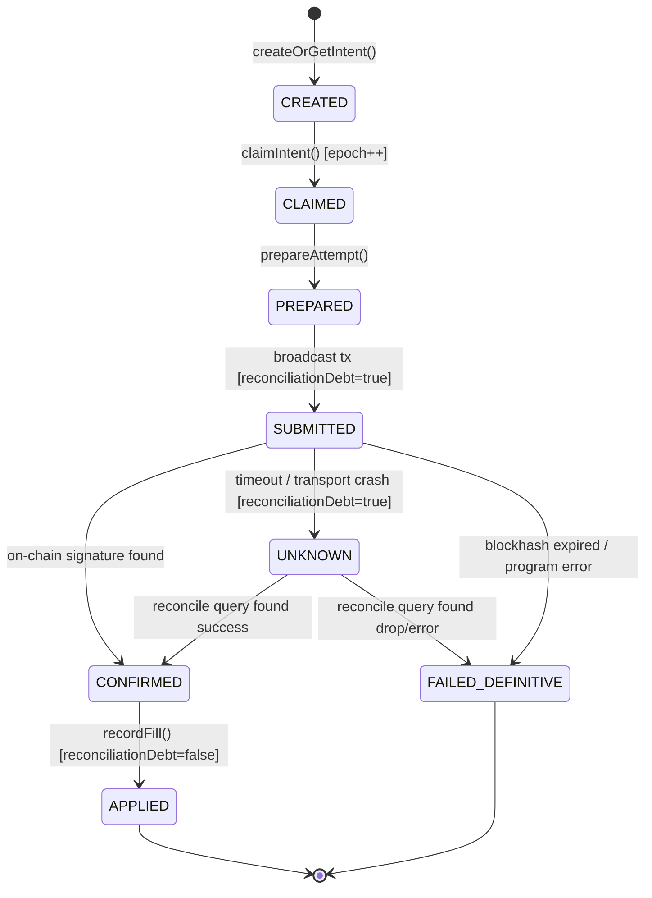

# NEXUS V2.1A — EXIT INTENT & EXECUTION ATTEMPT STATE MACHINE
> **Documento Normativo de Transições de Estado**  
> **Status:** ESPECIFICAÇÃO FORMAL VALIDADA  
> **Versão:** 2.1A  
> **Data:** 2026-10-04  

---

## 1. VISÃO GERAL DAS TRANSIÇÕES

O Nexus divide rigorosamente o ciclo de vida da saída em duas máquinas de estado coordenadas:
1. **ExitIntent State Machine**: Gerencia a intenção econômica macro e a exclusão da carteira.
2. **ExecutionAttempt State Machine**: Gerencia os estágios técnicos micro de transmissão RPC e confirmação de bloco na rede Solana.

---

## 2. TAXONOMIA DE ESTADOS DO INTENT

### 2.1 Estados Economicamente Ativos (Exclusão em Vigor)
Enquanto uma intent reside em qualquer um dos seguintes estados, **nenhuma outra intent conflitante pode ser criada para a mesma tupla `(wallet_id, mint)`**:
- `CREATED`: Intent persistida, aguardando claim de worker.
- `CLAIMED`: Worker adquiriu lease temporal exclusivo com `claim_epoch`.
- `PREPARED`: Ordem cotada e montada pelo provider Jupiter/Pump.
- `SUBMITTED`: Transação assinada e despachada para a rede Solana (`reconciliationDebt = true`).
- `CONFIRMED`: Transação pousou em bloco confirmado, mas o Fill ainda não foi aplicado ao saldo da posição.
- `UNKNOWN`: Falha de transporte, timeout HTTP ou queda do processo após envio. O intent permanece ativo com exclusão estrita para prevenir venda dupla.

### 2.2 Estados Terminais (Liberação da Exclusão)
Apenas estados comprovadamente definitivos liberam a exclusão econômica no partial unique index:
- `APPLIED`: Fills correspondentes registrados e saldo da posição formalmente reduzido.
- `CANCELLED`: Cancelamento formal ocorrido **antes** de qualquer envio à rede.
- `SUPERSEDED`: Substituição formal ocorrida **antes** de qualquer envio à rede.
- `FAILED_DEFINITIVE`: Tentativa comprovadamente morta por expiração de blockhash ou erro on-chain de instrução sem alteração de saldo.

> [!CAUTION]
> **UNKNOWN NÃO É TERMINAL.**  
> **SUBMITTED NÃO É TERMINAL.**  
> **HTTP_TIMEOUT NÃO É TERMINAL.**  
> **LEASE_EXPIRED NÃO É TERMINAL.**  
> Qualquer tentativa de interpretar queda de conexão como cancelamento resulta em risco crítico de execução concorrente desastrosa.

---

## 3. TRANSIÇÕES DA EXECUTION ATTEMPT

| Estado Origem | Evento / Ação | Estado Destino | Condição / Guarda |
|---|---|---|---|
| `INITIALIZED` | Cotação e montagem da rota | `ORDER_READY` | Rota válida retornada pelo provider |
| `ORDER_READY` | Assinatura local da transação | `SIGNED` | Chave privada em memória assina payload binário |
| `SIGNED` | Despacho via RPC (`sendTransaction`) | `SUBMITTED` | RPC aceita socket ou buffer local (`reconciliationDebt = true`) |
| `SUBMITTED` | Bloco confirmado na rede | `CONFIRMED` | Assinatura auditada on-chain com status `err: null` |
| `SUBMITTED` | Timeout HTTP / Socket Hangup | `UNKNOWN` | Resposta indeterminada (`reconciliationDebt = true`) |
| `SUBMITTED` | Expiração de Blockhash | `FAILED_DEFINITIVE` | Blockhash expirou sem inclusão nos blocos líderes |
| `SUBMITTED` | Erro On-Chain (Instruction Error) | `FAILED_DEFINITIVE` | Transação incluída mas revertida por programa (ex: 6001 Jupiter) |
| `UNKNOWN` | Reconciliação encontra assinatura | `CONFIRMED` | Consulta RPC após reboot encontra recibo válido |
| `UNKNOWN` | Reconciliação atesta expiração | `FAILED_DEFINITIVE` | Consulta RPC atesta que transação nunca entrou e blockhash morreu |

---

## 4. MATRIZ DE RECONCILIAÇÃO & INVARIANTE DE SEGURANÇA

1. **Invariante de Exclusão Mútua**:
   $$( \text{status} \in \text{ECONOMICALLY\_ACTIVE} \lor \text{reconciliation\_debt} = \text{true} ) \implies \text{Bloqueio de Novas Vendas}$$
2. **Invariante de Fencing**:
   $$\text{worker\_epoch} \neq \text{intent.claim\_epoch} \implies \text{Abort}(\text{StaleEpochError})$$
3. **Invariante de Ledger Append-Only**:
   $$\text{Tentativa de } UPDATE / DELETE \text{ em } \text{fill\_ledger} \implies \text{RAISE EXCEPTION}$$
